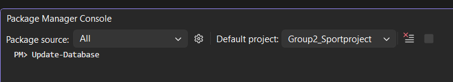
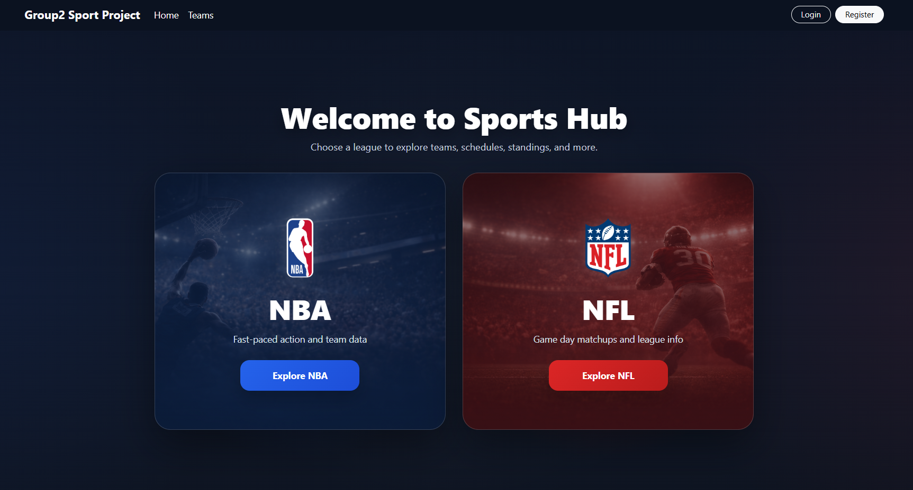
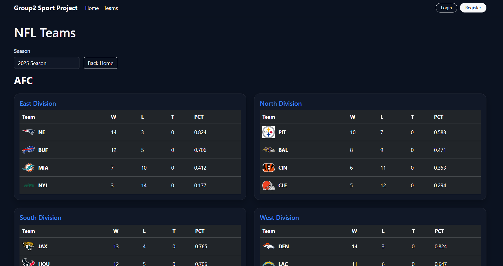
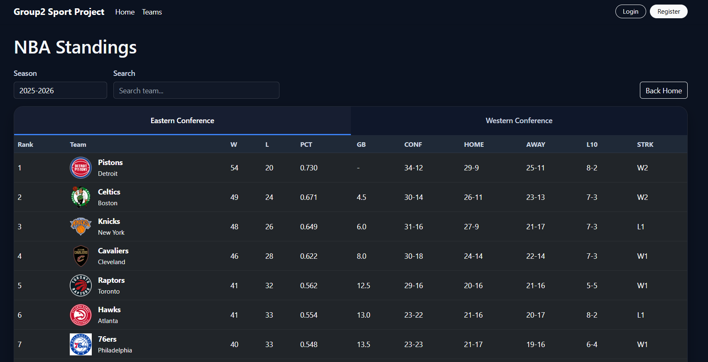

# Sports App Group Project 2
### Team: Robert, Caleb, Jason

## Description
- This is a web-based app that allows users to login and view sports stats from the NFL and NBA. Including team/player stats, standings, and match results.

## Getting Started:
First time users (_Required_):
<br>
_Please follow the instructions below before running the application_

1. Navigate to bar at top of solution
2. Tools > NuGet Package Maneger > Package Manager Console
3. In the Console (Bottom of solution) Run:

```
Update-Database
```
_Note: This will update your database on your local machine to get the login functionality working._

## Technologies Used
- ASP.NET Razor Pages
- HTML/CSS/JS
- C#
- SportsData.IO API [Link](https://sportsdata.io/developers/api-documentation/nfl)

# Screenshots
### Home Screen

<br>
### NFL Screen

<br>
### NBA Screen

